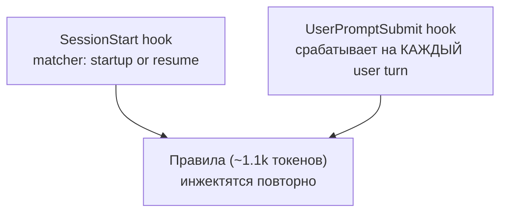
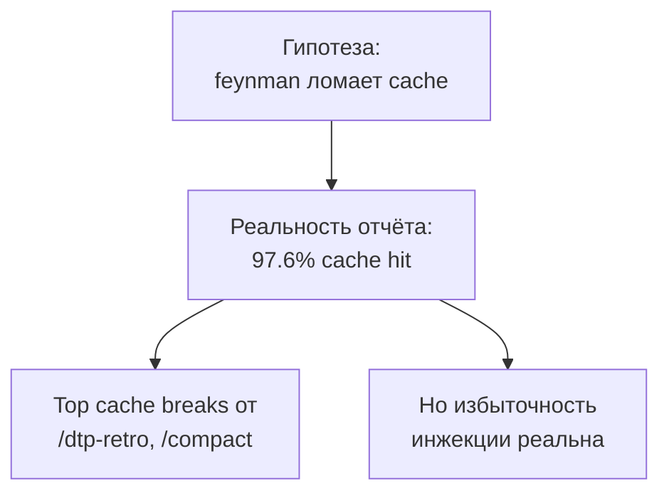
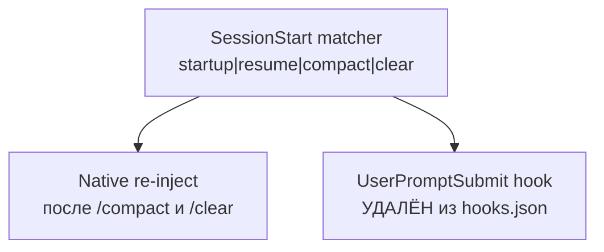
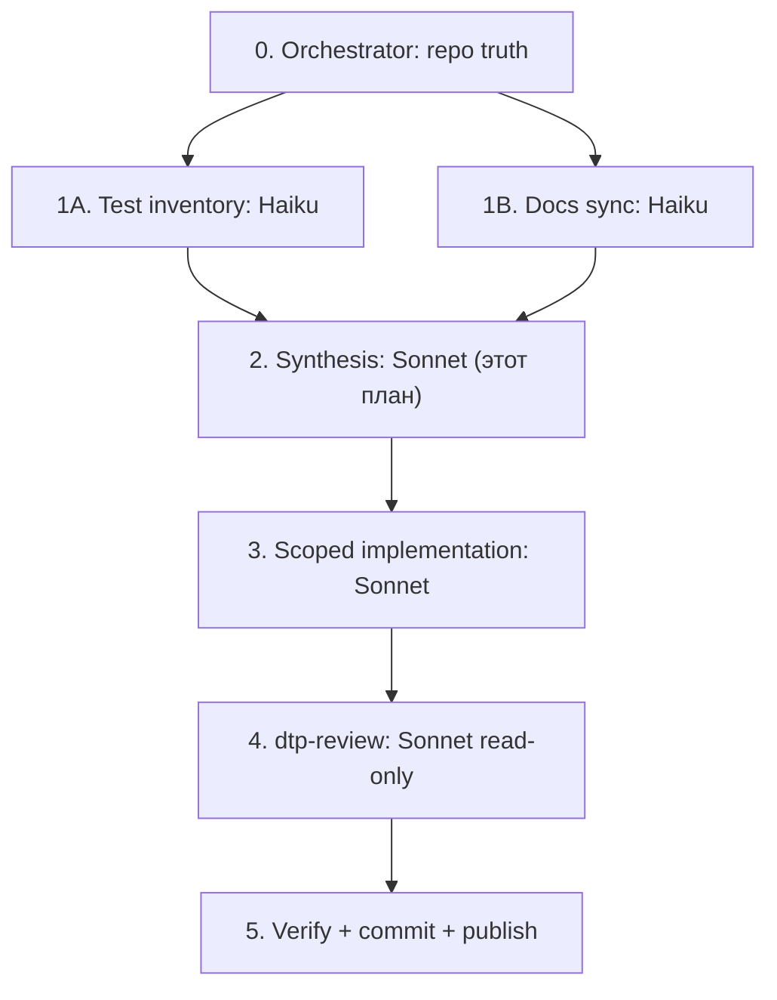

# Feynman v0.7.0 — SessionStart-only Injection (drop UserPromptSubmit)

## 0. Короткий TL;DR Для Человека

### Было



Коротко: feynman инжектит ASCII-diagram rules дважды — один раз на старте сессии
и снова на каждый user prompt. Пользователь увидел недельный session-report и
подумал, что это ломает кэш.

### Проблема



Коротко: данные отчёта НЕ подтверждают «feynman ломает кэш». Реальный
invalidator — `/compact` summarisation history. Однако per-turn injection
действительно избыточна — правила уже в session-history после первого turn'а.

### Станет



Коротко: убираем UserPromptSubmit, расширяем SessionStart matcher до четырёх
триггеров. Правила теперь приходят ровно тогда, когда нужно: новая сессия,
resume, после `/compact`, после `/clear`. Экономия ~1100 ток × N user turns
за сессию. Бамп до v0.7.0 (breaking behaviour).

## 1. Текущий State И Цель

- **Сейчас:** ветка `main`, clean working tree (только новый
  `.planning/plans/` от текущей сессии). HEAD на `v0.6.1`. Активной фазы GSD
  нет — milestone v0.5.0 Verbosity Economy завершён 2026-05-11. TTT не
  привязан (см. system-reminder при старте: `git:feynman → jira: ⚠ UNKNOWN`).
- **Уже сделано:** SessionStart hook существует и работает на `startup|resume`
  (см. `hooks/feynman-session-start.ts`). UserPromptSubmit логика
  (`hooks/feynman-activate.ts`) развита, тестирована, и используется CLI
  (`bin/feynman.ts doctor`).
- **Цель:** один PR + npm release v0.7.0 — feynman инжектит правила только
  через SessionStart, matcher расширен до четырёх триггеров. Симметрично для
  Claude Code и Codex. Все тесты зелёные.
- **Не цель:** оптимизировать сам rules-файл, менять схему `state.json`,
  трогать линтер, трогать /feynman skill. Side-deliverable (см. §16) — это
  follow-up, не блокирует релиз.

## 2. Skill Routing

| Intent                                  | Skill/source                                  | Output                       | Use / skip reason                  |
| --------------------------------------- | --------------------------------------------- | ---------------------------- | ---------------------------------- |
| подтверждение matcher семантики         | Context7 `code.claude.com/docs/en/hooks`      | matcher list + sample        | done — verified `startup\|resume\|compact\|clear` |
| Codex SessionStart семантика            | Context7 `/openai/codex`                      | event list + matcher policy  | done — unknown matchers молча skip |
| post-implementation review              | `dtp-review`                                  | PASS/BLOCK по diff           | use перед commit                   |
| release closeout                        | `dtp-retro` (short mode)                      | DONE/LEFT для v0.7.0          | use после publish                  |
| token-economy для subagent routing      | `dtp-token-economy`                           | модельная разводка           | use в §5 при делегации             |
| GSD phase accounting                    | `gsd-*`                                       | phase state                  | **skip** — нет активного milestone; v0.7.0 trivial enough для quick-phase |
| skill-creator audit (side)              | `skill-creator`                               | почему dtp-plan не цепляется автоматически в plannotator | use в §16 как parallel stream |
| installer/config recommendations        | installer audit / catalog                     | runtime drift report         | **skip** — feynman инсталлер изолирован от core-principles catalog |

Skills/sources skipped:

- `gsd-plan-phase` — изменение не требует full GSD-phase (no new requirements,
  no scope expansion). v0.7.0 — это hotfix-class change, не milestone.
- `gsd-new-milestone` — изменение помещается в existing v0.5.x maintenance.
  Если пользователь хочет именовать v0.7.0 как новый milestone — это решение
  оставить за человеком (Open Question 1 в §10).

## 3. Главный Deliverable

> [!IMPORTANT] **feynman v0.7.0 опубликован на npm** с одним поведенческим
> изменением: правила инжектятся только через SessionStart (`startup`,
> `resume`, `compact`, `clear`). UserPromptSubmit-инъекция отключена. Все
> существующие тесты зелёные. CHANGELOG.md, README.md, CLAUDE.md и plugin.json
> синхронизированы.

Side-deliverable (см. §16): черновик глобального правила «всегда планировать
через `dtp-plan`» для добавления в `core-principles` catalog + аудит
skill-creator поведения при `EnterPlanMode`/plannotator.

## 4. Что Меняем

- **`hooks.json`** — секция `UserPromptSubmit` удаляется; `SessionStart[0].matcher`
  меняется `"startup|resume"` → `"startup|resume|compact|clear"`. Один файл,
  две правки.
- **`hooks/feynman-activate.ts`** — **оставляем как есть**. Используется CLI
  (`bin/feynman.ts doctor`); код инкапсулирован, удалять не нужно. Просто
  перестаёт регистрироваться как hook entry в hooks.json.
- **`hooks/feynman-session-start.ts`** — **без изменений** (matcher семантика
  расширяется на стороне Claude Code, hook script отвечает на любой вызов
  одинаково).
- **`.claude-plugin/plugin.json`** + **`.codex-plugin/plugin.json`** —
  `"version": "0.6.1"` → `"0.7.0"`.
- **`package.json`** — `"version": "0.6.1"` → `"0.7.0"`.
- **`CLAUDE.md`** — architecture-диаграмма (раздел `## Architecture`) и блок
  `What NOT to Use` синхронизируются с новым поведением. Confidence-level
  таблица получает строку про verified matcher список.
- **`README.md`** — заголовочный bullet «via the `UserPromptSubmit` hook» →
  «via the `SessionStart` hook (re-injects after `/compact` and `/clear`)».
- **`CHANGELOG.md`** — запись v0.7.0 с motivation: **избыточность инжекции**
  + **дрейф контекста** (НЕ cache-invalidation — verified плохая мотивация).
- **Тесты:**
  - `hooks/feynman-session-start.test.ts` (или эквивалент) — добавить кейсы
    `matcher=compact`, `matcher=clear`.
  - Integration test, проверяющий что hooks.json регистрирует UserPromptSubmit,
    — удалить или пометить deprecated. Юнит-тесты feynman-activate.ts оставить.
- **Не трогаем:** rules/, lib/lint/, skills/feynman/, install.sh, lib/cli/,
  bin/.

## 5. Roadmap Субагентов



| Stage | Agent             | Model tier        | Scope                                   | Writes | Output                       |
| ----- | ----------------- | ----------------- | --------------------------------------- | ------ | ---------------------------- |
| 0     | Orchestrator (я)  | Sonnet (current)  | Git, planning, отчёт                    | план   | этот файл                    |
| 1A    | test-inventory    | Haiku             | grep `feynman-activate.test`, перечислить test cases | no  | список ≤30 строк             |
| 1B    | docs-sync-scan    | Haiku             | grep `UserPromptSubmit`, `every prompt` в README/CLAUDE/docs | no | список строк к замене        |
| 2     | (этот orchestrator) | Sonnet         | synthesis: merge §4 + 1A + 1B           | план   | финал §4                     |
| 3     | code-editor       | Sonnet            | hooks.json + plugin.json × 2 + package.json + docs | yes | scoped diff (single PR)      |
| 4     | dtp-review        | Sonnet read-only  | diff review против §13 pillar gate      | no     | PASS/BLOCK                   |
| 5     | release-runner    | Sonnet            | npm run release + publish + tag + push  | yes    | npm @0.7.0 + git tag         |

Subagent 1A и 1B запускаются **параллельно** в одном tool-use блоке после approve плана.

## 6. Token Economy

- **Haiku** для §5 stages 1A/1B — grep, inventory, классификация.
  Read-only. Не более 80 строк output на агента.
- **Sonnet** (текущий, я) — synthesis (§2 уже сделан), implementation
  (stages 3, 5), self-review (stage 4 если без BLOCK).
- **Opus / deep model — НЕ нужен.** Изменение архитектурно тривиально:
  два edits в hooks.json + version bump + docs sync. Public output
  contract не меняется (feynman всё ещё инжектит правила; меняется только
  частота).
- **Raw sessions** не читаем — отчёт уже распарсен, intake не нужен.
- **Context7** уже отработал в Stage 0 (validation отчёт получен).

## 7. Iteration Reserve

- **Plan hardening:** этот файл уже прошёл одну итерацию (v1 был отвергнут
  пользователем за non-dtp-plan форму). Текущая версия — v2. Резерв на ещё
  одну итерацию если self-check §11 или review (§12) выявят пробел.
- **Self-review:** перед ExitPlanMode прохожу чеклист §11 строка за строкой.
- **Feedback loop:** обратная связь пользователя про skill-creator аудит
  включена в §16 как parallel stream — не блокирует core deliverable.
- **Evidence refresh:** перед stage 3 — `git status --short` и `git pull`
  если HEAD за `origin/main`.
- **Token reserve:** ~15% контекста удержано на review (stage 4) и
  publish-failure rollback.

## 8. Visual Elements

Использованные элементы:

- `[!IMPORTANT]` (§3) — основной deliverable.
- ✓ ▲ ? — status marks в §10 и §11.
- Mermaid `flowchart TB` — TL;DR и roadmap.
- Pipe tables — skill routing, subagent roadmap, token economy, open questions.

Легенда (используется 3+ символа):

```
✓ done   ▲ risk   ? open   → next   ✗ blocked
```

## 9. Agent Does / Human Does

**Agent does:**

- read state, prepare план (✓ сделано в §1-7);
- spawn 2 Haiku subagents в параллель (test inventory + docs sync grep);
- edit hooks.json, plugin.json × 2, package.json, CLAUDE.md, README.md,
  CHANGELOG.md, тесты;
- run `npm run typecheck`, `npm test`, `npm run lint:md`;
- run smoke test через `FEYNMAN_HOME=/tmp/feynman-smoke` (см. §14);
- commit с conventional message + `Co-Authored-By`;
- npm run release → `npm publish dist/*.tgz`;
- `git tag v0.7.0` → `git push --tags`;
- post-publish: `dtp-retro --short` в `.planning/session-retros/`.

**Human does:**

- nothing by default.

Human needed only if:

- npm publish падает по 2FA или истёкшему токену (`▲ риск`) — тогда
  пользователь предоставит свежий npm OTP или token.
- pre-commit hook (husky) поднимет неожиданный failure, который требует
  scope-decision (тогда — спросить, не делать «--no-verify»).

## 10. Open Questions With Defaults

| Question                                                          | Default                                       | Ask human when                                    |
| ----------------------------------------------------------------- | --------------------------------------------- | ------------------------------------------------- |
| Это новый milestone в GSD или просто patch?                       | Patch — без `gsd-new-milestone`               | пользователь явно скажет «открой milestone»       |
| Bump 0.6.1 → 0.7.0 vs 0.6.2?                                      | 0.7.0 (breaking behaviour, semver minor)      | если пользователь сочтёт что не breaking          |
| Удалять ли feynman-activate.ts полностью?                         | НЕТ — используется CLI doctor                 | если пользователь явно скажет «выпили»            |
| Side deliverable (§16) делаем в этом же PR или отдельно?          | Отдельно — не блокирует релиз feynman         | если пользователь захочет объединить              |
| skill-creator аудит — read-only или с фиксом?                     | Read-only — сначала диагноз                   | после диагноза по результатам                     |

## 11. Self-Check

- [x] TL;DR is understandable without the rest of the plan.
- [x] Skill routing lists used and skipped skills/sources with reasons.
- [x] Three diagrams exist: Было, Проблема, Станет.
- [x] Diagrams are vertical/readable in Plannotator (`flowchart TB`, ≤4 nodes).
- [x] Subagent roadmap has model tier, scope, writes, output.
- [x] GPT Mini не используется (это Claude Code repo) — Haiku указан явно.
- [x] Iteration reserve exists for plan hardening and self-review (§7).
- [x] Visual elements are meaningful, not decorative.
- [x] Open questions have defaults (§10).
- [x] Human is not assigned agent-doable work (§9).
- [x] Acceptance commands are concrete (§14).

## 12. Review Gate

**Pre-fix review (перед stage 3):**

- Strategy: read-only diff preview через `git diff --stat` после Edits, но до
  commit. Проверка: только 7 файлов (hooks.json, 3 × .json для версии,
  CLAUDE.md, README.md, CHANGELOG.md) + опц. test файлы. Никаких dirty
  surprise-файлов.
- Output: PASS/BLOCK таблица. BLOCK если затронуты rules/, lib/lint/,
  skills/feynman/, install.sh без оснований.

**Post-fix review (перед commit, через `dtp-review` SKILL):**

- [ ] Source-of-truth alignment: hooks.json — единственный источник
  hook-регистрации, plugin.json не дублирует.
- [ ] Tests cover the bug class: SessionStart matcher `compact` и `clear`
  оба тестируются на rules extraction.
- [ ] No unrelated dirty files: `git status --short` показывает только
  ожидаемые 7-8 файлов.
- [ ] No hidden fallback zeros added.
- [ ] Stale comments обновлены: в CLAUDE.md строка
  «`SessionStart` hook instead of `UserPromptSubmit` ... Only fires once —
  rules lost after context compaction» — удалить (теперь не правда, мы
  ловим compact).

BLOCK handling: любой BLOCK — fix перед `git commit`. Никаких `--no-verify`.

## 13. Pillar Review

| Pillar          | Gate                                                                |
| --------------- | ------------------------------------------------------------------- |
| Workflow        | соответствует `dtp-plan` template (этот файл прошёл §11 self-check) |
| Git/TTT         | branch `main`, нет активного TTT task, commit будет на main         |
| Source of truth | hooks.json — single source; plugin.json лишь манифест версии        |
| Tests           | `npm test` + smoke в `/tmp/feynman-smoke` (см. §14)                 |
| Skills/docs     | `npm run lint:md` после edits                                       |
| Token economy   | Haiku × 2 параллельно для discovery; Sonnet для синтеза/правок      |
| Visual quality  | TL;DR диаграммы вертикальные, ≤4 nodes каждая                       |
| Iteration       | план прошёл v1 (rejected) → v2 (текущий) — есть зазор на v3         |

## 14. Acceptance Gate

```bash
# Static
npm run typecheck                     # exit 0
npm test                              # all green (post-edit)
npm run lint:md                       # exit 0

# Smoke — fresh-install harness
rm -rf /tmp/feynman-smoke && mkdir -p /tmp/feynman-smoke
echo '{}' | FEYNMAN_HOME=/tmp/feynman-smoke node hooks/feynman-session-start.ts | head -5
# expect: plain-text ASCII rules (lite/full/ultra block) на stdout

# Hook contract — verify UserPromptSubmit убран из hooks.json
jq '.hooks.UserPromptSubmit' hooks.json
# expect: null

# SessionStart matcher
jq -r '.hooks.SessionStart[0].matcher' hooks.json
# expect: startup|resume|compact|clear

# Manifest version sync
jq -r '.version' package.json .claude-plugin/plugin.json .codex-plugin/plugin.json
# expect: 0.7.0 (× 3)

# Publish dry-run
npm run release && ls -la dist/*.tgz
# expect: dist/feynman-0.7.0.tgz существует

# Final
git status --short --branch
# expect: на main, файлов меняется ≤ 10
```

## 15. Done Definition

Done только когда:

- ✓ hooks.json содержит только SessionStart с расширенным matcher;
- ✓ npm test зелёный;
- ✓ `npm view @albinocrabs/feynman version` возвращает `0.7.0`;
- ✓ `git tag --list v0.7.0` непуст и pushed (`git push --tags`);
- ✓ CHANGELOG.md содержит секцию `## [0.7.0] — 2026-05-17` с правильной
  motivation (избыточность + дрейф, НЕ cache);
- ✓ Post-publish `dtp-retro --short` записан в `.planning/session-retros/`;
- ✓ Side deliverable (§16) запущен как **parallel** track (не блокирует Done).

## 16. Side Deliverable — Plannotator/dtp-plan auto-routing audit

> [!NOTE] Это **отдельный stream**, не блокирует v0.7.0. Делается параллельно
> или после релиза. Затрагивает `core-principles` repo, не feynman.

**Запрос пользователя:** «добавить в Claude Code глобальную инструкцию что при
планировании всегда использовать skill `dtp-plan`. Через `skill-creator`
проверить, почему он не запускается автоматически когда мы планируем через
плантатор».

**Что делаем:**

1. **Аудит skill-creator skill** (read-only):
   - Прочитать `~/.claude/skills/skill-creator/SKILL.md`
   - Понять как `description` поле в skill frontmatter цепляется к
     auto-invocation
   - Прочитать `~/.claude/skills/dtp-plan/SKILL.md` — какой у него
     description, какие триггеры
   - Сравнить с plannotator skills (`plannotator-*`) — что у них в
     description'е, какие триггеры заставляют Claude Code их автоматом
     вызывать
   - Гипотеза: dtp-plan триггеры (`план`, `/plan`, `планируем`, `го`) могут
     перекрываться или конфликтовать с EnterPlanMode встроенным behaviour,
     поэтому Claude Code не отдаёт control в skill при plan mode.

2. **Глобальное правило в core-principles**:
   - В `/Users/ap/work/core-principles/catalog/claude-md/sources/planning-discipline.md`
     добавить параграф «when entering plan mode for code work — invoke
     `Skill(skill=dtp-plan)` first». Это становится частью managed
     marker block в `~/.claude/CLAUDE.md` через `make config-claude`.
   - Альтернатива (если правка catalog не подходит): hook
     `UserPromptSubmit` в core-principles, который при детекте
     plan-mode-related промпта (через env var или prompt content)
     суггерирует dtp-plan.

3. **Если skill-creator подсветит фиксимый баг** — open issue или PR в
   `core-principles`. Если нет — задокументировать как known limitation в
   `.planning/notes/`.

**Owner stream:** отдельный subagent (Sonnet или Haiku-research wave), не
блокирует feynman release. Можно запустить как `Agent({subagent_type: "general-purpose"})`
после ExitPlanMode и approve этого плана.

**Acceptance side-deliverable:**

- read-only audit report в `~/work/core-principles/.planning/notes/skill-creator-plannotator-audit-2026-05-17.md`
- если fixable — отдельный PR в core-principles
- если не fixable — known limitation документирован

---

**Готов к ExitPlanMode.** Следующее действие после approve — параллельно spawn
двух Haiku-агентов (test inventory + docs sync grep), затем atomic edits, тесты,
review, publish.
