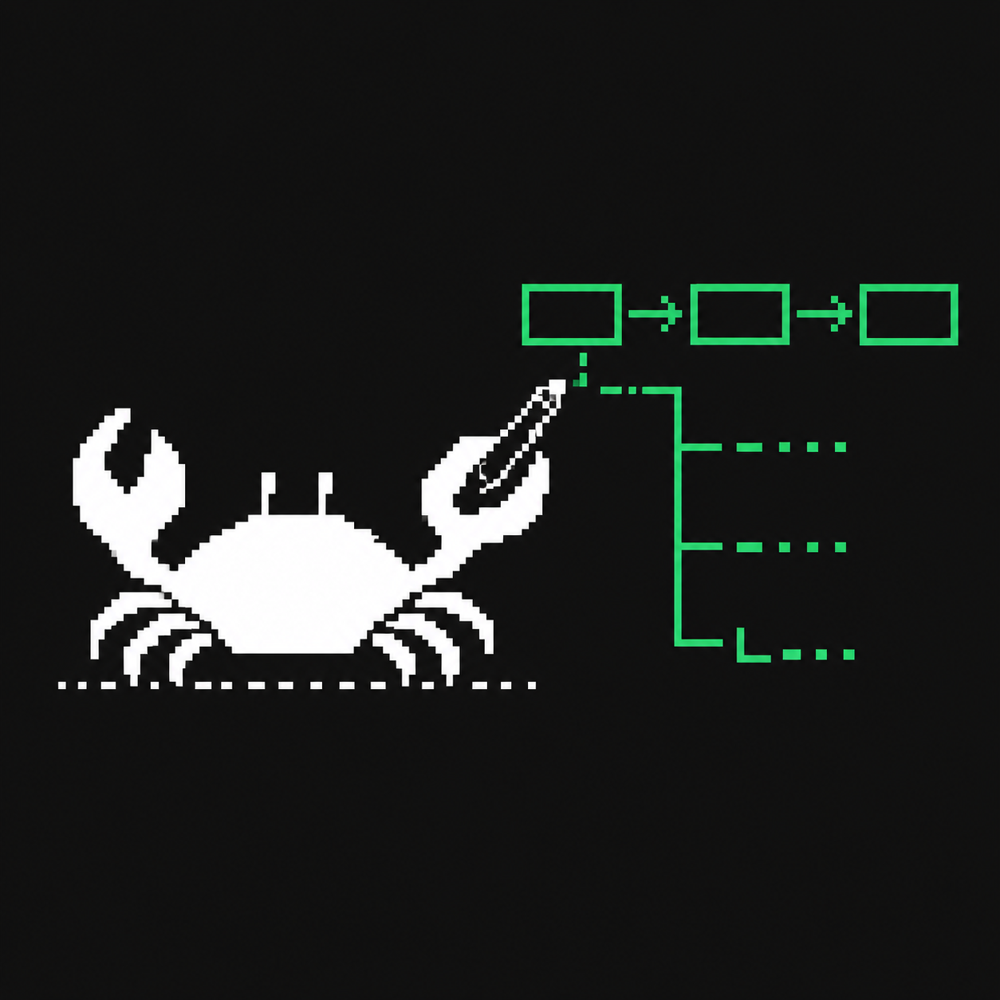

<p align="center">
  
</p>

<h1 align="center">feynman</h1>

<p align="center">
  <strong>why explain in words when diagram do trick</strong>
</p>

<p align="center">
  <a href="https://www.npmjs.com/package/@albinocrabs/feynman"></a>
  <a href="https://github.com/apolenkov/feynman/actions/workflows/ci.yml"></a>
  <a href="https://github.com/apolenkov/feynman/blob/main/.github/coverage-badge.json"></a>
  <a href="LICENSE"></a>
  <a href="https://github.com/apolenkov/feynman/stargazers"></a>
  <a href="https://github.com/apolenkov/feynman/commits/main"></a>
</p>

<p align="center">
  <a href="#why-feynman">Why</a> •
  <a href="#why-feynman-uses-userpromptsubmit-not-sessionstart">Compaction</a> •
  <a href="docs/object-passport.md">Passport</a> •
  <a href="#before--after">Before/After</a> •
  <a href="#install">Install</a> •
  <a href="#verify-the-install">Verify</a> •
  <a href="#intensity-levels">Levels</a> •
  <a href="#security-notes">Security</a> •
  <a href="#token-budget-and-output-size">Tokens</a> •
  <a href="#lint">Lint</a> •
  <a href="#examples">Examples</a> •
  <a href="docs/launch.md">Launch</a> •
  <a href="CONTRIBUTING.md">Contributing</a>
</p>

---

A [Claude Code](https://docs.anthropic.com/en/docs/claude-code) and Codex
plugin that automatically injects ASCII diagram rules through `SessionStart`
and `UserPromptSubmit` hooks.

```bash
npx -y @albinocrabs/feynman@latest install --target all
npx -y @albinocrabs/feynman@latest doctor --target codex
```

## Why feynman

Structured information explained in prose forces you to rebuild the structure
in your head before you can reason about it. feynman intercepts every Claude
Code or Codex prompt and injects rules that turn flows into arrows,
hierarchies into trees, comparisons into columns, and status into frames. The
structure is visible before you have to think about it.

Conceptually, feynman is inspired by prompt-compression ideas from the Caveman
agent style: smaller prompts, clearer intent, and explicit diagram-first thinking.

### Why feynman uses UserPromptSubmit (not SessionStart)

Claude Code compacts the context window automatically as a conversation grows.
Anything injected by a `SessionStart` hook is part of that early context and is
lost the moment compaction runs. The `UserPromptSubmit` hook fires on every turn,
so feynman re-injects its diagram rules after every compaction event — the rules
survive the entire session, not just the opening turn.

## Governance docs

- `AGENTS.md` — project execution contract for Codex-aware tooling.
- `CLAUDE.md` — canonical project memory, stack, and architecture constraints.
- Global instructions are loaded from user-level runtime configuration before repo-specific overrides.

## Before / After

<table>
<tr>
<td width="50%">

### Without feynman

> "The deployment pipeline has three stages: first the code is built, then tests run, then it deploys to prod."

</td>
<td width="50%">

### With feynman

```
[Build] --> [Test] --> [Deploy]
```

</td>
</tr>
<tr>
<td>

### Without feynman

> "Option A is fast but stateless. Option B is slower but persists data. Option C gives you both at higher cost."

</td>
<td>

### With feynman

```
Option A       | Option B      | Option C
---------------|---------------|----------
fast startup   | slow startup  | medium
stateless      | persistent    | persistent
free           | free          | $$$
```

</td>
</tr>
<tr>
<td>

### Without feynman

> "Fix the auth bug first since it's a security issue, then the memory leak, then the slow query."

</td>
<td>

### With feynman

```
▲ high
  auth bug (security)
  memory leak
▼ low
  slow query
```

</td>
</tr>
<tr>
<td>

### Without feynman

> "The auth service talks to Redis for rate limiting and Postgres for user data."

</td>
<td>

### With feynman

```
[Auth Service]
     ├── [Redis]    rate limiter
     └── [Postgres] user data
```

</td>
</tr>
</table>

## Install

**Install to Codex by default (when --target is omitted):**

```bash
npx @albinocrabs/feynman install
```

**Codex via npx:**

```bash
npx @albinocrabs/feynman install --target codex
```

**Both clients:**

```bash
npx @albinocrabs/feynman install --target all
```

The install command is idempotent: running it again updates the existing
feynman hook instead of adding duplicates.

**Claude Code via bash one-liner:**

```bash
git clone https://github.com/apolenkov/feynman && bash feynman/install.sh
```

Restart Claude Code or Codex after install so a fresh `SessionStart` hook can
prime the session.

**Uninstall:** `npx @albinocrabs/feynman uninstall --target claude|codex|both|all|*`

**Plugin manifests:** this repo also ships `.claude-plugin/plugin.json`,
`hooks/hooks.json`, `.codex-plugin/plugin.json`, and `hooks.json` for direct
client integrations. The npx installer remains the production fallback because
both clients still support direct user hook registration.

<details>
<summary>Manual install</summary>

Add to `~/.claude/settings.json` — use the absolute path, not `~/`
([bug #8810](https://github.com/anthropics/claude-code/issues/8810)):

```json
{
  "hooks": {
    "SessionStart": [
      {
        "matcher": "startup|resume",
        "hooks": [
          {
            "type": "command",
            "command": "node \"/absolute/path/to/feynman/hooks/feynman-session-start.js\"",
            "timeout": 5
          }
        ]
      }
    ],
    "UserPromptSubmit": [
      {
        "hooks": [
          {
            "type": "command",
            "command": "node \"/absolute/path/to/feynman/hooks/feynman-activate.js\"",
            "timeout": 5
          }
        ]
      }
    ]
  }
}
```

For Codex, add the same shape to `~/.codex/hooks.json` and set
`FEYNMAN_HOME` so state lives under `~/.codex`:

```json
{
  "hooks": {
    "SessionStart": [
      {
        "matcher": "startup|resume",
        "hooks": [
          {
            "type": "command",
            "command": "FEYNMAN_HOME=\"$HOME/.codex\" node \"/absolute/path/to/feynman/hooks/feynman-session-start.js\"",
            "timeout": 5
          }
        ]
      }
    ],
    "UserPromptSubmit": [
      {
        "hooks": [
          {
            "type": "command",
            "command": "FEYNMAN_HOME=\"$HOME/.codex\" node \"/absolute/path/to/feynman/hooks/feynman-activate.js\"",
            "timeout": 5
          }
        ]
      }
    ]
  }
}
```
</details>

After install, feynman starts in `full` mode by default. Disable or change it
explicitly with `/feynman off`, `/feynman lite`, `/feynman full`, or
`/feynman ultra`.

## IDE Support

feynman also installs into project-local rules folders for Cline, Cursor, and
Windsurf. These targets write a single rules file in the current working
directory — no global hook, no settings mutation. The rules file is derived
from the `full` intensity block of `rules/feynman-activate.md`.

| Target | Output path (relative to CWD) | Frontmatter |
|--------|-------------------------------|-------------|
| `claude` | `~/.claude/settings.json` (hook) | — |
| `codex` | `~/.codex/hooks.json` (hook) | — |
| `cline` | `.clinerules/feynman-rules.md` | none |
| `cursor` | `.cursor/rules/feynman.mdc` | `alwaysApply: true`, `globs: "**"` |
| `windsurf` | `.windsurf/rules/feynman.md` | none |

Install:

```bash
cd your-project
npx @albinocrabs/feynman install --target cline
npx @albinocrabs/feynman install --target cursor
npx @albinocrabs/feynman install --target windsurf
```

Doctor (verify):

```bash
npx @albinocrabs/feynman doctor --target cline
npx @albinocrabs/feynman doctor --target cursor
npx @albinocrabs/feynman doctor --target windsurf
```

`doctor` exits `0` when the rules file is present (and, for Cursor, when
the YAML frontmatter has `alwaysApply: true`). Otherwise it exits `1` with
a `[FAIL]` reason.

To regenerate after upstream changes — just re-run `install`. The command
is idempotent: it overwrites the rules file in place. No uninstall path
is provided for IDE targets (delete the directory if you need to undo).

## Verify the install

Run `doctor` after installing or after manually editing hooks:

```bash
npx @albinocrabs/feynman doctor --target codex
npx @albinocrabs/feynman doctor --target claude
npx @albinocrabs/feynman doctor --target all
```

A healthy target reports both hook events and both hook script files as `OK`:

```text
[OK] hook registered (feynman-session-start.js in SessionStart)
[OK] hook registered (feynman-activate.js in UserPromptSubmit)
[OK] session hook script file exists and is readable
[OK] prompt hook script file exists and is readable
Status: OK
```

For Codex, runtime state should live under `~/.codex`:

```bash
cat ~/.codex/.feynman/state.json
test -f ~/.codex/.feynman-active
```

For Claude Code, use `~/.claude` instead of `~/.codex`. `doctor` fails if a
registered hook command cannot be parsed to a real hook script, which catches
stale or broken manual installs.

## Intensity Levels

| Level | What draws | Use when |
|-------|-----------|----------|
| **lite** | Flows + trees only | Minimal, subtle |
| **full** | All 5 diagram types (default) | Normal use |
| **ultra** | Force diagram even for short answers | Maximum visual structure |

Toggle via `/feynman`:

```
/feynman lite    — flows and trees only
/feynman full    — all diagram types
/feynman ultra   — force diagrams always
/feynman off     — disable
/feynman on      — re-enable
/feynman status  — show current state (intensity + output_style)
```

### Output-Style Presets

Orthogonal axis to intensity. **Intensity** controls how much instruction
the model sees (rules-file size). **Output style** controls how heavy the
model's visuals can be (runtime hint).

| Preset | Visuals allowed | Token cost vs. full | Use when |
|--------|-----------------|---------------------|----------|
| **short** | Inline glyphs + dot-leader only | ~−60% on status-heavy replies | Mobile, dense chat, voice input |
| **middle** | + trees + markdown tables; frame ≥6 items | ~−25% | Balanced default |
| **full** | + frame blocks + side-by-side + ASCII art | baseline (current default) | Spec docs, retros, design |

Toggle:

```
/feynman style short   — minimal visuals
/feynman style middle  — balanced
/feynman style full    — all visuals (default)
```

Implementation note: output-style is enforced via a one-line runtime
suffix in the prompt-submit hook — it does NOT modify `rules/feynman-activate.md`,
so the 4480-byte budget stays intact.

## Lint

feynman includes a linter for ASCII diagrams. It catches structural errors
before they reach readers: unclosed boxes, wrong tree characters, mixed arrow
styles, inconsistent column counts, mixed-script words, and more.

```bash
npx @albinocrabs/feynman lint response.md            # detect only (exit 1 on error)
npx @albinocrabs/feynman lint --fix response.md      # detect + repair frames in place
npx @albinocrabs/feynman lint --explain response.md  # annotate frames with token cost
```

`--fix` rebuilds the top/bottom borders and pads inner rows of every frame
block (`┌─...─┐ ... └─...─┘`) so the right edge aligns by visual column —
ANSI escapes, combining marks, zero-width joiners are stripped, CJK wide
chars count as 2 cols. Additionally, L11-overdecorated frames (≤5 inner
lines without nested trees or embedded table columns) convert to dot-leader
lists (`label ........ state`) — Unicode markers preserved, indentation
preserved. Idempotent on already-clean files.

`--explain` is read-only — it emits a per-frame breakdown showing
`framing: ~N chars (border: B, padding: P, content: C)`,
`equivalent dot-leader: ~M chars`, and the saving. Use it to understand
why L11 or L12 fired and how many chars a lighter visual would save.

See [docs/lint-rules.md](docs/lint-rules.md) for the full L01-L13 reference.

### Quick hard-disable / re-enable (testing and emergency)

For temporary global disable in Codex (for smoke tests or troubleshooting), use:

```bash
touch ~/.codex/.feynman-disable-global    # hard OFF
rm ~/.codex/.feynman-disable-global       # hard ON
```

This bypasses `~/.codex/hooks.json` hook execution entirely.
Regular `/feynman off` and `/feynman on` continue to use normal profile state
files (`~/.codex/.feynman-active`, `~/.codex/.feynman/state.json`).

## Security notes

feynman hooks are local prompt-context hooks. They do not require network
access, do not read repository files, and do not read credentials. The active
mode is stored only in the client-local state path:

```text
~/.claude/.feynman/state.json
~/.codex/.feynman/state.json
```

The hook runtime treats invalid state as disabled for that turn, removes the
activation flag, and stays silent. That prevents a corrupted state file from
silently forcing diagram rules into future prompts.

`uninstall` removes only feynman hook commands and preserves unrelated hooks in
the same hook group. `doctor` validates that registered commands point to real
hook scripts, so broken manual commands are visible before a session depends on
them.

## CLI examples

Quickly discover and view repository prompt templates:

```bash
feynman examples
feynman examples --name feature-planning
feynman examples --name incident-response
feynman examples --random
```

Export a ready-to-distribute local package (examples, rules, plugins, and skill):

```bash
feynman bootstrap
feynman bootstrap --out ./feynman-package
feynman bootstrap --out ./feynman-package --force
```

This is useful for disconnected/air-gapped installs where you want to copy one
folder with all `Feynman` assets instead of depending on `npm`.

Slash command aliases (inside Claude/Codex):

```text
/feynman on | off
/feynman start | stop
/feynman lite | full | ultra
/feynman status
```

## Examples

Run a concrete example in the needed style:

```bash
feynman examples --name <example-name>
```

> Tip: all examples are ready-to-run templates in `examples/*.md`, can be copied into prompts or docs, and rendered as a compact ASCII layout with `feynman examples --name ...`.

```text
[Flow]  [Architecture]   [API]        [Decisions]
  |          |            |              |
  v          v            v              v
 [Action]  [System]    [Lifecycle]   [Reasoning]
    ↓          ↓            ↓              ↓
 [Outcome] [Design]     [Change]      [Choice]
```

## Visual example gallery

### Flow and actioning

#### Incident-ready action playbooks

- [Activity sequence](examples/activity-sequence.md) — incident action plans with rollback gates  
  ```
  [Incident] --> [Triage] --> [Contain] --> [Mitigate] --> [Review]
                                   | no         |
                                   v            |
                                [Rollback] <----+ 
  ```
- [Incident response](examples/incident-response.md) — triage and containment sequence  
  ```
  [Detect] --> [Classify] --> [Isolate] --> [Communicate]
                                  |
                                  +--> [Recover]
  ```
- [Bug isolation](examples/bug-isolation.md) — stateful diagnostic flow with priorities  
  ```
  ▲ high
    high-likelihood
  ▼ low
    narrow scope
    documentation
  ```
- [Release readiness](examples/release-readiness.md) — staged launch gates and recovery triggers  
  ```
  [Build] --> [QA] --> [Dark launch] --> [General] 
                       | no             | yes
                       v                v
                 [Rollback]        [Monitor]
  ```

### Architecture and design

- [Architecture review](examples/architecture-review.md) — auth system decomposition  
  ```
  Auth
  ├── Service
  │   ├── Redis rate limits
  │   └── Postgres users
  └── Observability
      └── Events
  ```
- [C4 platform design](examples/c4-platform-diagramming.md) — context → container → component  
  ```
  [User] --> [Web] --> [API] --> [DB]
  ```
- [Context splitting](examples/context-splitting.md) — decomposing complex initiatives  
  ```
  Initiative
  ├── Domain A
  ├── Domain B
  └── Domain C
  ```
- [Database schema](examples/db-schema.md) — entity model as structured tree  
  ```
  Report
  ├── Metadata
  ├── Sections
  └── History
  ```

### API and migration

- [API flow](examples/api-flow.md) — request lifecycle with branch diagnostics  
  ```
  [Client] --> [Auth] --> [Service] --> [DB]
                        | yes          |
                        +-->[Cache] ---+
  ```
- [Deploy pipeline](examples/deploy-pipeline.md) — CI/CD action chain  
  ```
  [Source] --> [Build] --> [Test] --> [Canary] --> [Scale]
              |             |
              v             +--> [Rollback]
  ```
- [Service migration](examples/service-migration.md) — cutover with risk controls  
  ```
  [Old service] --> [Dual write] --> [Read compare] --> [Cut over]
                                        | mismatch
                                        v
                                  [Stop migration]
  ```

### Decisions and methods

- [Feature planning](examples/feature-planning.md) — decision matrix + phased rollout  
  ```
  [Need] --> [Plan] --> [Run experiment] --> [Scale]
             |        |
             +--> [Kill-switch]
  ```
- [Algorithm walkthrough](examples/algorithm-explain.md) — rate-limiter logic as explainable sequence  
  ```
  [Need decision?] --> [Compute score] --> [Allow / Deny]
  ```
- [Code review](examples/code-review.md) — issue prioritization and evidence matrix  
  ```
  ▲ must-fix       [security]
    ▲ medium       [performance]
      ▼ low        [docs]
  ```

### One-command pack test

```bash
feynman examples --name activity-sequence && \
feynman examples --name incident-response && \
feynman examples --name c4-platform-diagramming
```

## Visual gallery (before → after)

If you want to quickly see how diagram-first responses evolve, this is the core pattern:

Without feynman:

`We need to choose between shipping fast with a managed API, keeping control in-house, or a hybrid path while managing risk and cost.`

With feynman:

```
[Is SLA strict?] --> [Yes] --> [Prefer managed service]
                 |             |               |
                 |             v               v
                 |      [Contract + vendor risk] --> [Is rollback cheap?]
                 |                                   |
                 v                                   +--> [Yes] --> [Adopt + guardrails]
        [Can we build fast?]                            +--> [No]  --> [Hybrid path]
                 |
      no ------ +------- yes
       |                |
       v                v
 [Build in house]   [Run controlled managed pilot]
```

Same brief question, different clarity level.

```
criterion      | build in-house | managed API | hybrid
---------------|----------------|-------------|----------------
launch speed   | slow           | fast        | medium
vendor lock-in | low            | high        | medium
compliance     | high control   | partner SLA | custom controls
cost           | low initial    | medium      | medium-high
```

Use this gallery style if you want `feynman` examples to look “production-clean”
from day one.

## How it works

The `SessionStart` hook primes fresh Claude Code or Codex sessions with the
active rules, and the `UserPromptSubmit` hook reinforces them on every prompt.
Both hooks read the target-local state file
(`~/.claude/.feynman/state.json` or `~/.codex/.feynman/state.json`), extract
the rules for the active intensity level, and inject them into model context.

```
[your prompt]
      +
[feynman rules]    injected by hook
      │
      ▼
 [Claude Code]
      or
   [Codex]
      │
      ▼
[structured response with ASCII diagrams]
```

## Token budget and output size

feynman always adds some input context when it is enabled, because the active
diagram rules are injected into the client prompt context. It does not add
visible output by itself; output changes only when the assistant uses the
rules.

Current rule payload sizes are approximately:

| Mode | Bytes | Approx tokens | Use when |
| ---- | ----- | ------------- | -------- |
| `lite` | 1307 | 317 | minimal flows and trees |
| `full` | 2180 | 532 | default diagram coverage |
| `ultra` | 1390 | 337 | force diagrams more often |

The token count is a rough `chars / 4` estimate, not a billing counter. The
actual number depends on the runtime tokenizer and surrounding hook envelope.

The plugin can reduce output size when a diagram replaces repeated prose,
especially for flows, status summaries, hierarchies, and comparisons. It can
increase output for short answers where a diagram would be unnecessary, so the
rules explicitly suppress diagrams for one- or two-sentence direct answers.
Use `/feynman lite` for lower overhead or `/feynman off` when token budget is
more important than visual structure.

## Release process

Every push runs tests on Node 18 and 20 across Ubuntu and macOS. The release
lane also lints public docs, smoke-tests the packed npm tarball, builds a
`dist/*.tgz` artifact, and can publish to npm from a GitHub Release when
`NPM_TOKEN` is configured. If the token is absent and the package version is
already published, the workflow updates release notes and exits successfully;
for a new publish, it fails with a clear message so token-less publication
cannot silently pass.

```bash
npm run ci
npm run changelog
npm run build
```

### GitHub release path

1. Tag and release from GitHub (or run workflow_dispatch with `dry_run=false`).
2. Ensure repository secret `NPM_TOKEN` is set (only needed for first publish
   of a new version).
3. Keep version/tag aligned: release tag must equal `package.json` with `v`
   prefix (enforced by workflow).
4. Create release notes generated from `CHANGELOG.md` and verify package
   availability after publish.
5. Mark PRs for auto-merge with labels `auto-merge` and `status:ready` and
   keep required review approvals in place.

Set or rotate `NPM_TOKEN` with:

```bash
gh secret set NPM_TOKEN -r apolenkov/feynman
```

State is stored at `~/.claude/.feynman/state.json`. First run bootstraps
automatically. See [docs/architecture.md](docs/architecture.md) for internals.

## Contributing

See [CONTRIBUTING.md](CONTRIBUTING.md) for setup, PR checklist, and
rules-authoring guidelines.

## License

MIT
