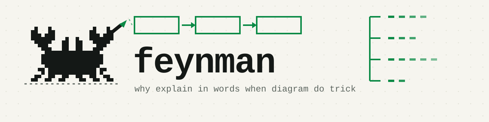
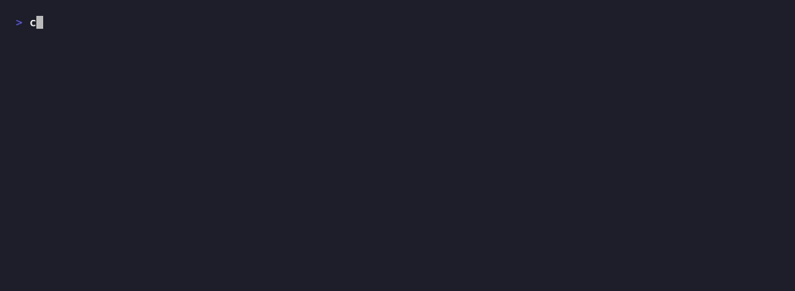

<p align="center">
  <picture>
    <source media="(prefers-color-scheme: dark)" srcset=".github/assets/banner-dark.svg">
    
  </picture>
</p>

<p align="center">
  <a href="https://github.com/apolenkov/feynman/actions/workflows/ci.yml"></a>
  <a href="https://www.npmjs.com/package/@albinocrabs/feynman"></a>
  <a href="LICENSE"></a>
  
  
  <a href="https://skills.sh/apolenkov/feynman"></a>
</p>

**feynman adds visual-explanation instructions to Codex: a skill that turns relationships into diagrams, an optional session hook, and an ASCII diagram linter.**



## Why

Some answers are about relationships: what calls what, what happens first,
which branch is taken. A diagram shows those at a glance. The native skill
guides Codex through extracting relationships from text, choosing a readable
layout, and checking the finished diagram against the supplied facts. An
optional local CLI installs session-wide diagram guidance and provides an ASCII
linter.

Use it when you want a visual explanation. The earlier controlled comparison
did not establish clearer answers than ordinary Codex responses and exhibited
factual and instruction-compliance failures. See the historical
[evaluation report](docs/evaluation-3ab9de4.md). Technical test results do not
establish explanation quality.

## Features

- **Codex skill.** Extracts entities, relationship verbs, conditions and
  uncertainty from text, then picks a flow, graph, hierarchy, table or list.
- **SessionStart hook (optional).** Restores the diagram rules on `startup`,
  `resume`, `compact` and `clear`, so they survive context compaction without
  being repeated on every prompt.
- **ASCII linter.** `feynman lint` checks diagrams in Markdown for unclosed
  boxes, bad trees, mixed arrows, column widths and frame-width mismatches
  (rules L01 to L15), with `--strict` and `--json` modes. See [lint rules](docs/lint-rules.md).
- **Local only.** The CLI has zero third-party runtime dependencies, and the
  hook writes no telemetry.

## Install

### Native Codex plugin

```bash
codex plugin marketplace add apolenkov/feynman --ref main
codex plugin add feynman@feynman
```

Open `/plugins` in Codex to search for **Feynman**, install it, then start a
new session. The skill is discoverable for visual architecture, ASCII diagrams,
flows, trees, comparisons, priorities, and status summaries.
Explanation requests work directly from the packaged skill; they do not need
the CLI, a hook, network access, or local state setup.

### skills.sh (Codex)

For teams that distribute skills through [skills.sh](https://www.skills.sh/),
install the same Codex-only skill directly from this repository:

```bash
npx skills add apolenkov/feynman --skill feynman --agent codex --global --yes
```

For settings, the skill invokes an already installed local `feynman` executable
from `PATH`, or an absolute executable path supplied by the user. It never uses
a remote package runner or installs or updates the CLI as a side effect. The
skills.sh catalog is indexed asynchronously after installations, so a newly
released source can take a short time to appear in search.

### Local hook and CLI

```bash
npm install --global --ignore-scripts @albinocrabs/feynman@2.1.1
feynman install
feynman doctor
```

The installer targets Codex by default and writes only to `~/.codex`. It is
idempotent. Uninstall with:

```bash
feynman uninstall
```

This persistent CLI setup is optional. Upgrade it only as a separate explicit
action by installing the intended version; skill settings never trigger an
install or upgrade. The GitHub project `apolenkov/feynman` and npm package
`@albinocrabs/feynman` are the two distribution paths for the same project.
Get the attestation URL with
`npm view @albinocrabs/feynman@2.1.1 dist.attestations.url`. Open that URL and
decode the SLSA attestation's base64 `bundle.dsseEnvelope.payload`; its
`predicate.buildDefinition` identifies the repository, release workflow and
source commit. Check these against the intended GitHub release. Provenance
identifies the source and build; it does not establish that the code is safe.

The native plugin supplies the Codex skill. The CLI installer registers the
`SessionStart` hook that injects the selected ruleset into a session.
After installing or updating the hook, open `/hooks` in Codex, review and trust
its current definition, then start a new session. Codex skips new or changed
hooks until they are trusted. This step applies to the optional hook; standalone
skill explanations need no hook setup.

## Usage

In Codex, ask for a visual explanation: architecture, a flow, a tree, a
comparison, priorities or a status summary. The instructions separate meaning
from layout: preserve entities, relationship verbs, conditions and uncertainty,
then choose a flow, graph, hierarchy, table or list. Whole-text transformations
must retain every in-scope fact. Shared nodes and cycles need explicit
connections; a tree is reserved for a hierarchy. Diagrams use the requested
width, or 80 display columns by default.

An explicit diagram request takes precedence over automatic style limits;
prose-only requests remain prose. Model compliance is not guaranteed.

```text
[Build] --> [Test] --> [Deploy]
```

### CLI

```bash
feynman install             # register the Codex hook
feynman doctor              # inspect the local Codex installation
feynman state lite          # set diagram intensity
feynman state style short   # choose an output-style preset
feynman status              # show current state
feynman uninstall           # remove feynman registration, keep state
feynman lint README.md      # lint ASCII visuals in a file
feynman lint --strict FILE  # treat warnings as errors
feynman examples            # list bundled examples
feynman bootstrap --out DIR # export an operable local bundle
feynman version
```

The CLI has zero third-party runtime dependencies and requires Node.js 22.18 or
newer. The native explanation skill does not need Node.js until you explicitly
request a CLI operation.

`bootstrap --force` replaces only a previous Feynman export with ownership
metadata. It refuses unrelated, symlinked and protected destinations.

## Configuration

The hook has three persistent settings (intensity, output style, on/off), managed only through the CLI:

```bash
feynman state lite|full|ultra   # diagram intensity, default: full
feynman state style short       # output-style preset: short, middle or full
feynman state on|off            # enable or disable diagram assistance
feynman status                  # show current state
```

State lives under `~/.codex/.feynman/`. These preferences apply to the
CLI-installed hook; standalone skill explanations follow their packaged
instructions and your request.

## Repository map

```text
core contract       rules/, lib/state/     Contract, state model, pure rules
application         bin/commands/          CLI use cases
adapters            bin/adapters/, hooks/  Codex filesystem and SessionStart integration
lint subsystem      lib/lint/              parser, rules, reporter
quality             tests/, scripts/       tests, checks, package build
Codex distribution  plugins/feynman/       native marketplace plugin
documentation       docs/, CONTEXT.md      architecture, decisions, vocabulary
specifications      openspec/specs/        active testable requirements
```

The core contract never depends on commands or adapters; commands coordinate
the local Codex/filesystem adapters. The linter is a separate application path
sharing only small domain-neutral utilities. See
[Architecture](docs/architecture.md) for the full map and boundaries.

## Development

```bash
git clone https://github.com/apolenkov/feynman.git
cd feynman
npm ci
npm run ci
```

Before opening a pull request, run `npm run ci` and lint each changed Markdown file
with `npm run lint -- <file.md>`. Use Conventional Commits. Keep changes focused and
add a test for changed behavior.

The quality gate checks formatting, types, typed lint, behavior, coverage scope,
documentation and byte-for-byte package reproducibility. The live comparison
of explanations is separate: the latest 96-answer experiment completed and
failed its acceptance criteria. See the [results](docs/evaluation-3ab9de4.md)
and [protocol](evals/protocol-v2.md).
The new [ASCII transformation protocol](evals/ascii-transformation-protocol.md)
tests complete fact preservation and readable relationships through the actual
delivery paths. Its [research rationale](docs/ascii-explanation-research.md)
distinguishes these checks from unproven claims about human reading speed.

See [CONTRIBUTING.md](CONTRIBUTING.md) for contribution workflow,
[SECURITY.md](SECURITY.md) for private vulnerability reports, and
[docs/release.md](docs/release.md) for publishing. See
[docs/codex-plugin.md](docs/codex-plugin.md) for the native plugin contract.

## Privacy and license

feynman is local-only: its hook reads packaged rules and Codex-local state and
writes no telemetry. Skill settings invoke only an already installed local CLI;
they do not fetch packages. The hook itself makes no network request.
See [PRIVACY.md](PRIVACY.md). Licensed under the MIT License.
